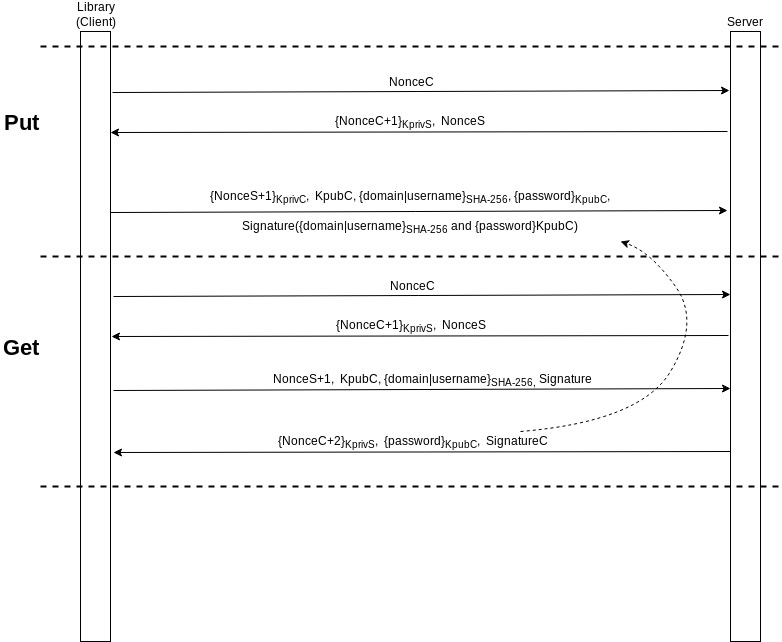

# DependablePM
Dependable Password Manager (SEC Project)

# Protocol

# How to compile and execute tests
- Extract zip file contents
- Go to <folder>/crypto-lib and run 'mvn clean compile install'
- Go to <folder>/pm-server and run 'mvn clean compile install'
- Go to <folder>/pm-client and run 'mvn test' to run demonstration tests